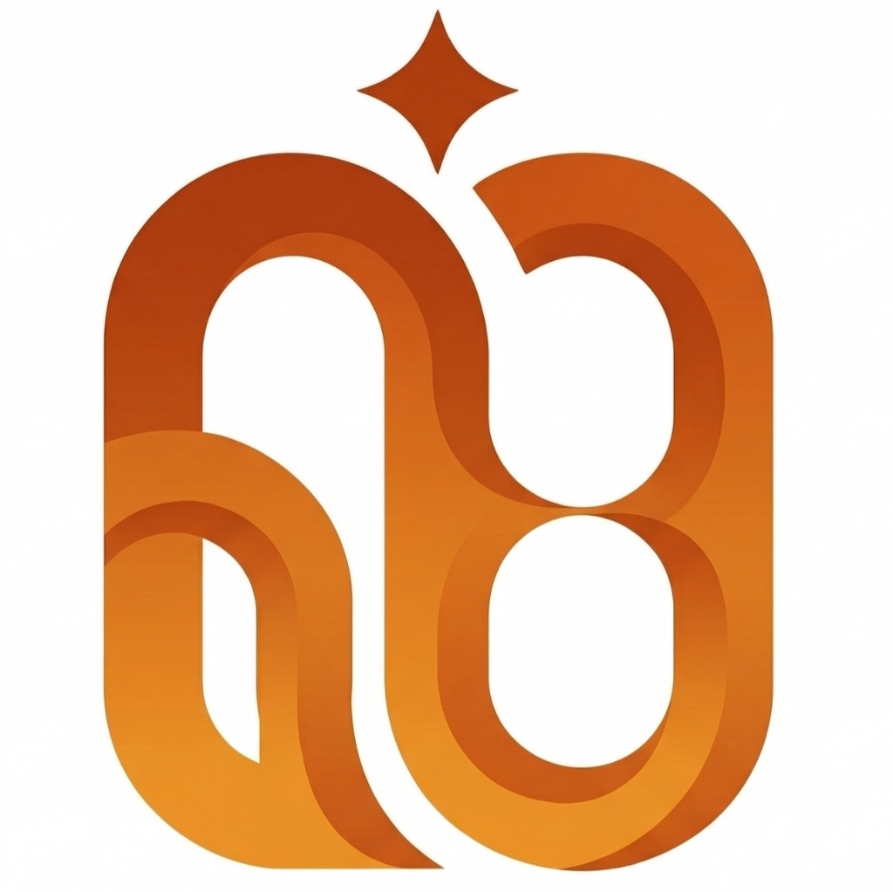

# 🚀 Portofolio Nurhadi — IDS Store Technology

<p align="center">
  
</p>

<p align="center">
  <strong>Pengembang IoT, Hardware Designer, Fullstack Web (Laravel) & Mobile (Flutter)</strong><br>
  <em>Owner & Hardware Engineer di IDS Store Technology</em>
</p>

<p align="center">
  <a href="https://laravel.com"></a>
  <a href="https://flutter.dev"></a>
  <a href="https://espressif.com"></a>
  <a href="https://kicad.org"></a>
  <a href="https://tailwindcss.com"></a>
</p>

---

## 📌 Tentang Portofolio

Website portofolio ini dibangun menggunakan **Laravel** dan **Tailwind CSS** dengan arsitektur modular Blade, menyajikan profil profesional, etalase keahlian rekayasa hardware, implementasi IoT, aplikasi software, dan katalog produk resmi **IDS Store Technology**.

---

## 🛠️ Keahlian & Spesialisasi Teknis

| Bidang | Teknologi / Alat | Lingkup Pekerjaan |
| :--- | :--- | :--- |
| **IoT & Embedded Systems** | ESP32, ESP8266, Arduino, STM32 | Riset, prototyping, integrasi sensor & aktuator, komunikasi MQTT / HTTP REST |
| **Desain Skematik & PCB** | KiCAD, EasyEDA, Altium Designer | Skematik sirkuit, routing multi-layer, kalkulasi jejak daya, file Gerber & BOM |
| **Web Development** | Laravel, PHP, Blade, Tailwind CSS, MySQL | Dashboard monitoring IoT, RESTful API, sistem autentikasi, manajemen data |
| **Mobile & Desktop App** | Flutter, Dart | Aplikasi kontrol perangkat via Bluetooth Low Energy (BLE), Wi-Fi, dan Serial |
| **Hardware Assembly** | Soldering SMD/THT, Power Bench Supply | Perakitan hardware, kalibrasi voltase/arus, pengujian ketahanan (stress test) |

---

## 💡 Unggulan Projek & Portofolio

### 1. Smart Digital PSU V1.0.2
- **Deskripsi**: Catu daya digital presisi terintegrasi dengan proteksi OVP/OCP, kalibrasi otomatis, serta dashboard kontrol via konektivitas wireless dan desktop/mobile.
- **Teknologi**: Mikrokontroler ESP32, Modul ADC/DAC presisi, PCB Kustom, Flutter App, Web Dashboard Laravel.

### 2. IoT Telemetry & Industrial Monitoring
- **Deskripsi**: Sistem akuisisi data sensor berbasis cloud dengan visualisasi grafik real-time, logging data historis, dan alarm notifikasi.
- **Teknologi**: ESP32, MQTT Broker, Laravel Backend, Tailwind CSS, MySQL.

### 3. IDS Store Technology Hardware Catalog
- **Deskripsi**: Etalase produk hardware siap pakai, kit mikrokontroler, modul converter daya, serta jasa custom rancang PCB dan prototype IoT.

---

## 📂 Struktur Modul Portofolio

```bash
resources/views/
├── layout/
│   └── topbar.blade.php        # Navigasi sticky responsive & racing-themed toggle menu
├── sections/
│   ├── hero.blade.php          # Banner profil, avatar IDS Store, dan CTA
│   ├── skills.blade.php        # Slider horizontal kartu keahlian teknis
│   ├── projects.blade.php      # Showcase projek dengan slider snap & galeri
│   ├── store.blade.php         # Katalog produk IDS Store & filter kategori
│   ├── modal-lightbox.blade.php# Lightbox zoom gambar projek & sertifikat
│   └── scripts.blade.php       # Kontroler JS untuk interaksi, slider, & modal
└── welcome.blade.php           # Entry view utama
```

---

## ⚡ Instalasi & Menjalankan Lokal

Pastikan telah menginstal **PHP >= 8.2**, **Composer**, dan **Node.js**:

1. **Clone repositori**:
   ```bash
   git clone https://github.com/nh-hadi/porto_nurhadi.git
   cd porto_nurhadi
   ```

2. **Install dependensi PHP**:
   ```bash
   composer install
   ```

3. **Salin file environment & generate app key**:
   ```bash
   cp .env.example .env
   php artisan key:generate
   ```

4. **Jalankan server lokal**:
   ```bash
   php artisan serve
   ```
   Akses di browser: `http://localhost:8000` (atau via virtual host Laragon).

---

## 📬 Kontak & Kolaborasi

- **Nama**: Nurhadi
- **Brand / Store**: IDS Store Technology
- **GitHub**: [@nh-hadi](https://github.com/nh-hadi)
- **Repositori**: [porto_nurhadi](https://github.com/nh-hadi/porto_nurhadi.git)

---
<p align="center">
  Dibuat dengan ❤️ oleh <strong>Nurhadi</strong> • © 2026 IDS Store Technology
</p>
